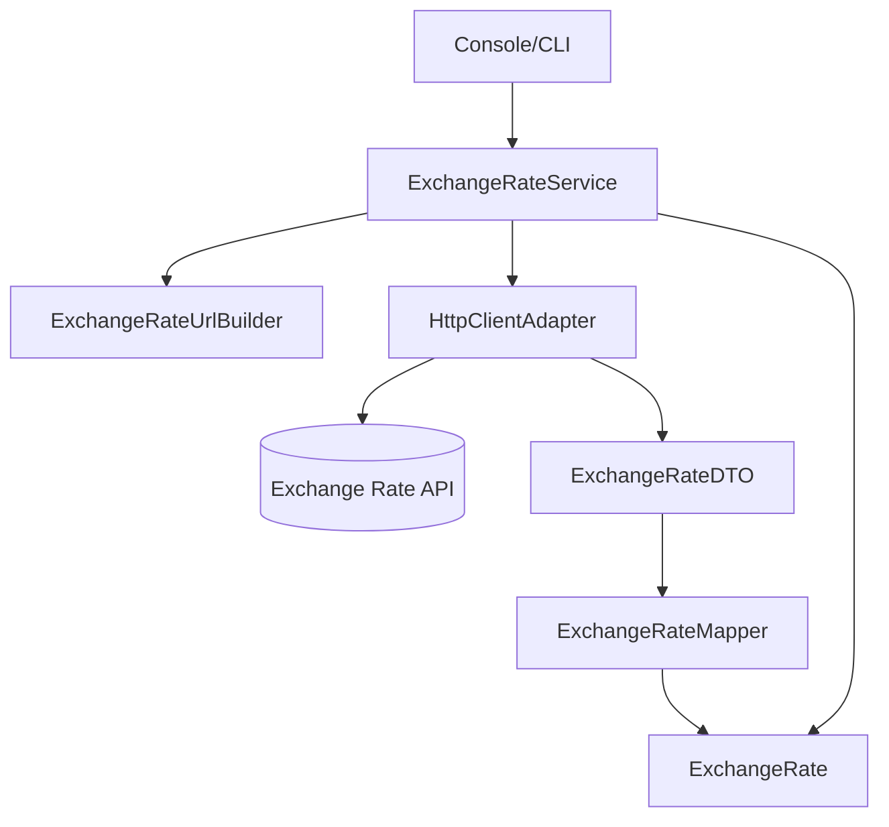

# 💱 Currency Converter (Java)

Conversor de moedas em **Java**, usando arquitetura em camadas, boas práticas de design e consumo de API externa.

---

## 🚀 Sobre o Projeto

Um aplicativo **console** que converte valores entre diferentes moedas utilizando a **ExchangeRate-API**. O foco do projeto é aplicar boas práticas de arquitetura, separação de responsabilidades e tratamento robusto de erros.

**Principais características:**

- Arquitetura em **Camadas (Layered Architecture)**
- Uso de **DTO + Service + Mapper + Adapter**
- API externa para buscar taxa de câmbio em tempo real
- Exceções customizadas com mensagens claras de erro
- Código organizado e extensível

---

## 🧱 Estrutura do Projeto

```bash
br.com.gustavokenzo.currencyConverter/
├── application/
│   └── Program.java
├── presentation/
│   └── MenuDisplay.java
├── domain/
│   ├── entities/
│   │   └── ExchangeRate.java
│   ├── services/
│   │   └── ExchangeRateService.java
│   └── exceptions/
│       ├── CurrencyConverterException.java
│       ├── ApiKeyNotFoundException.java
│       └── ExchangeRateApiException.java
└── infra/
    ├── dto/
    │   └── ExchangeRateDTO.java
    ├── http/
    │   ├── HttpClientAdapter.java
    │   └── ExchangeRateUrlBuilder.java
    └── services/
        └── ExchangeRateMapper.java
```

---

## 🔧 Tecnologias Utilizadas

- **Java 17+**
- **HttpClient (Java 11+)** para requisições HTTP
- **Gson** para parse JSON
- **ExchangeRate-API** para taxas de câmbio

---

## 🛠️ Como Executar o Projeto

### ✅ Pré-requisitos

- Java 17 ou superior instalado
- Adicionar biblioteca Gson no projeto
- Adicionar variável de ambiente com sua **API Key**:

#### 🪟 Como adicionar variável de ambiente no **Windows** via interface gráfica

1. Abra o menu **Iniciar** e digite: `Variáveis de Ambiente`
2. Clique em 👉 **Editar as variáveis de ambiente do sistema**
3. Na janela que abrir, clique em **Variáveis de Ambiente...**
4. Em **Variáveis do usuário**, clique em **Novo...**
5. Em **Nome da variável**, coloque:
   ```txt
   EXCHANGE_RATE_API_KEY
   ```
6. Em **Valor da variável**, coloque sua API Key:
   ```txt
   sua_api_key_aqui
   ```
7. Clique em **OK** em todas as janelas para salvar.

✅ Para confirmar se foi configurado corretamente:

Abra o **Prompt de Comando (cmd)** e digite:
```sh
set EXCHANGE_RATE_API_KEY
```
Se aparecer sua chave, está tudo certo.

### ▶️ Rodando a aplicação

```sh
cd src/main/java
java application/Program
```

---

## 💡 Como Funciona

1. Usuário escolhe um tipo de conversão no menu
2. O serviço monta a URL para a ExchangeRate-API
3. Faz a requisição HTTP e recebe JSON
4. JSON é convertido para DTO → Entidade → Valor convertido

Fluxo simplificado:

```
Program → ExchangeRateService → HttpClientAdapter → API externa
```

---

## 🎯 Tratamento de Erros

O projeto possui exceções customizadas, como:

- `ApiKeyNotFoundException` – quando a API Key não está configurada
- `ExchangeRateApiException` – erro de conexão / API fora
- `CurrencyConverterException` – erros de domínio

A aplicação **não quebra**, exibe a causa do erro e sugere solução.

---

## 🧠 Boas Práticas Adotadas

✔ SRP – cada classe tem uma única responsabilidade 
✔ DTOs e Entities separados 
✔ Encapsulamento de lógica de dependências em Services
✔ Mapper dedicado para conversão JSON → Objeto 
✔ Validações no domínio (**fail-fast**)

---

## 📈 Melhorias Futuras

- ✅ Suporte a mais moedas via Enum ou Map
- 🔜 Internacionalização (i18n)
- 🔜 Testes unitários (JUnit + Mockito)
- 🔜 Logging com SLF4J

---

## 🤝 Contribuição

Sinta-se à vontade para abrir PRs ou issues com sugestões. Toda melhoria é bem-vinda!

---

## 🪪 Licença

Este projeto é de uso livre para fins educacionais.

---

> Desenvolvido por **Gustavo Kenzo** como parte de um projeto da **Alura** com foco em boas práticas e clean code.

## Diagrama de Arquitetura



